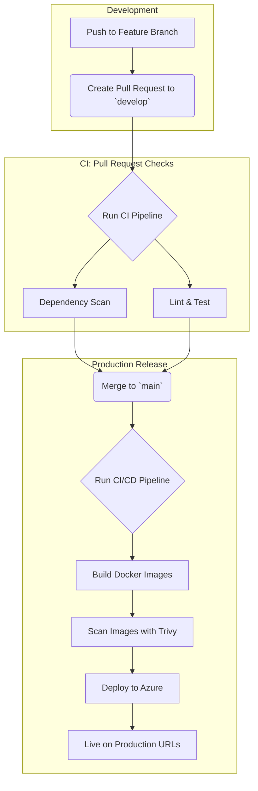

# Proud Citizen 🇷🇼

[](https://github.com/Euwamahoro/proud-citizen/actions)
[](https://opensource.org/licenses/MIT)
[](https://github.com/Euwamahoro/proud-citizen)

A virtual platform connecting Rwandan youth with elders to preserve and share national history, cultural values, and future aspirations through intergenerational dialogue.

## 🎥 Video Demonstration

A full demonstration of the CI/CD pipeline and deployment process is available here:  
**[Link to Video Demonstration](https://go.screenpal.com/watch/cTivYynIyzN)**

## 🌐 Live Production Environment

| Service | URL | Status |
|---|---|---|
| **Frontend** | [proudcitizen-frontend-app.grayisland-c2f3c413.eastus2.azurecontainerapps.io](https://proudcitizen-frontend-app.grayisland-c2f3c413.eastus2.azurecontainerapps.io) | [](https://proudcitizen-frontend-app.grayisland-c2f3c413.eastus2.azurecontainerapps.io)
| **Backend** | [proudcitizen-backend-app.grayisland-c2f3c413.eastus2.azurecontainerapps.io](https://proudcitizen-backend-app.grayisland-c2f3c413.eastus2.azurecontainerapps.io/healthz) | [](https://proudcitizen-backend-app.grayisland-c2f3c413.eastus2.azurecontainerapps.io/healthz)

## 🌟 Key Features

| Feature | Description |
|---|---|
| 🔒 **Secure Authentication** | User registration and login protected by JWT (JSON Web Tokens). |
| 💬 **Discussion Hubs** | A platform for virtual communities and intergenerational conversations. |
| ✨ **Modern UI** | A responsive and user-friendly interface built with React and Tailwind CSS. |
| 🚀 **Automated Deployment**| Fully automated CI/CD pipeline ensures rapid and reliable releases. |

## 🛠️ Tech Stack & Infrastructure

| Category | Technologies |
|---|---|
| **Frontend** | React, TypeScript, Tailwind CSS, Vite |
| **Backend** | Node.js, Express, MongoDB (Mongoose) |
| **Infrastructure** | Docker, Azure Container Apps, Azure Container Registry, GitHub Actions |
| **DevSecOps**| `npm audit` (Dependency Scanning), `Trivy` (Container Image Scanning) |

## 🚀 Deployment Pipeline

The pipeline is fully automated, triggered by pull requests and merges to the `develop` and `main` branches.



## 🛡️ Security Implementation

Security is integrated directly into our CI/CD workflow, preventing vulnerabilities from reaching production.

1.  **Dependency Scanning**: Before any build, `npm audit` scans all Node.js packages for known vulnerabilities.
2.  **Container Image Scanning**: After building the Docker images, **Trivy** performs a comprehensive scan. The pipeline is configured to fail and halt the deployment if any `CRITICAL` severity vulnerabilities are discovered.

Example Trivy Scan Step from `cd.yml`:
```yaml
- name: Scan frontend image
  run: |
    trivy image --exit-code 1 --severity CRITICAL ${{ env.ACR_NAME }}.azurecr.io/proud-citizen-frontend:${{ github.sha }}
```

## 📂 Repository Structure
```
proud-citizen/
├── .github/
│   └── workflows/
│       └── cd.yml        # The complete CI/CD pipeline for deployment
├── backend/              # Node.js & Express API source code
├── frontend/             # React & Tailwind CSS source code
├── .dockerignore         # Specifies files to ignore in Docker builds
├── .gitignore            # Specifies files to ignore for Git
├── CHANGELOG.md          # Manual log of notable changes and releases
├── docker-compose.yml    # For easy local containerized development
└── README.md             # This file
```
## 💻 Local Development

The recommended way to run the project locally is with Docker.
